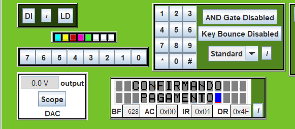
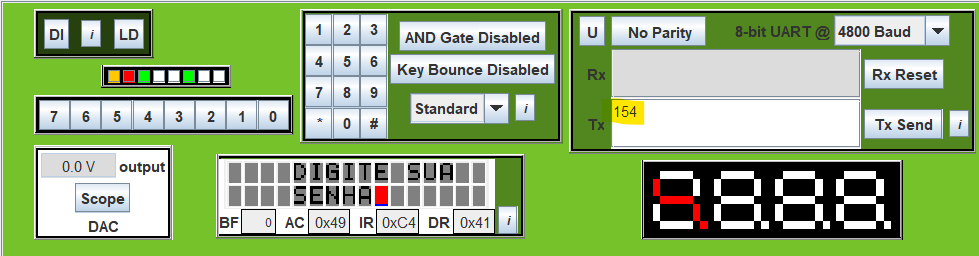
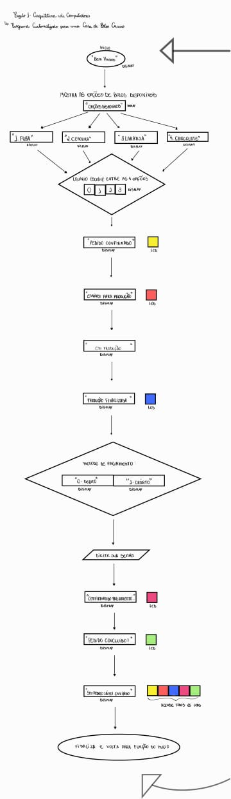

# Programa Automatizado para Casa de Bolos Caseiros
## Projeto 1 de Arquitetura de Computadores
  
  ### Descrição do Projeto
#### Este projeto foi desenvolvido para aplicar, na prática, os conhecimentos teóricos e laboratoriais adquiridos na disciplina de Arquitetura de Computadores, integrando-os em uma única implementação.

  O conceito inicial era criar um programa inspirado no funcionamento de máquinas de café automáticas, onde o cliente faz o pedido e acompanha o preparo através de um display ou luzes, simulando um processo automatizado. Decidimos adaptar essa ideia para uma Casa de Bolos Caseiros, em que o cliente pode escolher o tipo de bolo desejado e acompanhar, em tempo real, cada etapa, desde a preparação do pedido até a finalização.

  Essa simulação busca reproduzir a experiência de um sistema interativo e transparente, oferecendo ao cliente uma visão de todo o processo de produção e entrega. A implementação do projeto explora o conceito de automação aplicada a um modelo de negócios, permitindo uma experiência personalizada e interativa.

## Funcionalidades
#### Seleção de bolo: O cliente escolhe o sabor e o tipo de bolo que deseja.
#### Etapas de produção: O programa simula e exibe cada etapa do preparo do bolo.
#### Feedback visual: O cliente é informado sobre o andamento do processo, acompanhando a preparação e a finalização em tempo real.
#### Automação de processos: Conceito de automação aplicado a uma loja fictícia de bolos, com foco na transparência do processo e na experiência do cliente.

  ### Segue abaixo algumas fotos das partes principais do projeto:
  
  
  
    OBS: Na parte dos leds, selecionamos uma parte do projeto onde todos ja estavam acesos, mas no desenvolvimento do codigo os leds acendem um por vez (com as cores que foram definidas no fluxograma) até chegar a parte final onde todos permanecem acessos mostrando que foi concluido. 

## Fluxograma
  
